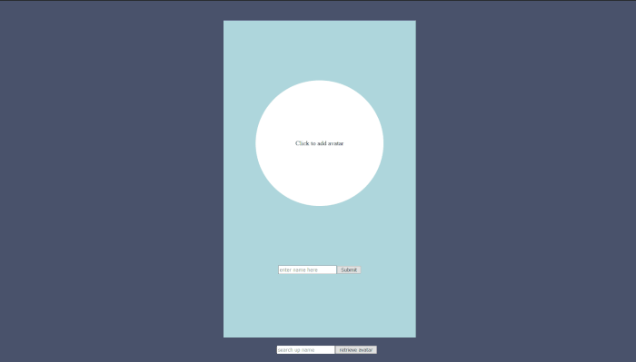

<h1>Avatar Image Upload</h1>

this is just a small snippet image upload using cloudinary, mongodb, react

I purposely did not work on the UI, as this is just a small snippet. I was using cloudinary for the first time and so I just wanted to create a quick mern application

<ol>
    <li>clone git repo</li>
    <li>npm install</li>
    <li>add the enviornmental variables</li>
    <li>npm run dev</li>
</ol>